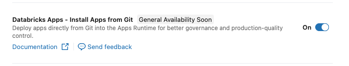
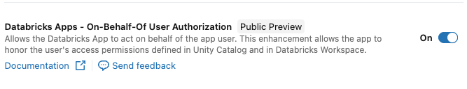
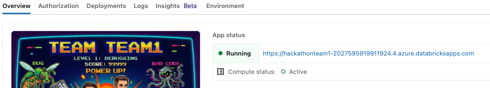

# Databricks Cost and Optimization Dashboard

> **Hackathon Project** — Built by a 2-person team in under 48 hours at the T1A Hackathon.

A Streamlit-based dashboard for monitoring and optimizing Databricks workspace usage, costs, and cluster/job activity. Deployed as a [Databricks App](https://docs.databricks.com/en/dev-tools/databricks-apps/index.html).

## Apps Pages

### Active Compute
This page exists to show how many clusters of each type are running in the workspace at a glance, and to provide quick access to start/stop and auto-termination settings.
Clusters can be created by different people and they can forget to set the auto-termination or stop the cluster after use, which can lead to unnecessary costs. 
✅ This page help an admin or CEO to quickly find the problem and solve it.

This page helps you make a quick decision whether to stop a cluster that's been left on. In the future this page will have more statistics and recommendations to help optimize costs, but for the hackathon we focused on the core functionality of monitoring and managing active compute resources.
- **All-Purpose Clusters** — View all non-job clusters with status, worker counts, estimated DBU/hr, ✅ auto-termination settings, and uptime. Start/stop clusters and edit auto-termination timeouts directly from the UI.
- **SQL Warehouses** — Same operational view for SQL Warehouses, including inline ✅ auto-stop configuration.
- **Apps** — Monitor running Databricks Apps and their compute state. 
✅ *Note: The Databricks Apps do not have functionality to auto stop the apps. That is why this page is important.*
- **Lakebase** — View active Lakebase database instances and their states.
- **Jobs Compute** — See all currently active job cluster runs across the workspace.

### Compute Monitoring

- **All-Purpose Daily Runs** — Gantt chart of cluster state transitions (STARTING, RUNNING, INACTIVITY, etc.) for a selected date. Includes inactivity periods before auto-termination. Also shows a stacked bar chart of daily runtime over the last 90 days, clickable to drill into a specific day.
You can quickly see daily details for how long the cluster has been running and doing some work or just being inactive. You can click on any day to drill down into this day and see detailed info for this day of each cluster that was used in that day.
- **Jobs in All-Purpose Cluster** — Combined view for a specific cluster: its state timeline, all job runs on that cluster, and a concurrency chart — all on a shared time axis. This is a more detailed vies of the previos page with a detailed information on specific cluster. For now it just shows jobs that were running on the cluster. In the future the users' activity will be added for a more complete picture of the cluster usage.

### Jobs

- **Job Settings** — Audit table of all jobs showing cluster type, schedule (with cron expression), Spark version, and ✅/❌ indicators for failure notifications, access control, and other health settings. Quickly spot misconfigured jobs at a glance — hover cells for details. Planned: a one-click or scheduled notification to alert the job owner about missing configuration.  
- **Jobs Runs (Daily)** — Heatmap grid of job run statuses (SUCCESS / FAILED / CANCELED / RUNNING / NO RUN) per job per day over a configurable lookback period. Includes run/stop buttons per job.
- **Jobs Timeline (Hourly)** — Gantt chart of all job runs for a selected date with a concurrency chart (5-minute buckets). Overlays projected scheduled runs from cron expressions for jobs that haven't executed yet. This allows to understand when most jobs run during a day. This gives an admin an opportunity to optimize the schedule of the jobs to make sure that not all jobs are running at the same time and consuming all resources. The charts additionaly displayed scheduled jobs that haven't run yet.
- **Job Fails Details** — Focused failure analysis: stacked bar chart of daily outcomes, and a detailed table of failed/timed-out runs with direct links to the job and run in the Databricks UI. The main focus of this chart is to show the latest unresolved problems with the jobs.

All pages support timezone selection across 10 common zones.

### Planned Features
- Cost estimates in USD (with configurable $/DBU rates)
- Team-level filters 
- Mean job runtime to see which jobs are taking the longest time to complete and optimize them first
- Optimization recommendations (e.g., flag clusters with high inactivity ratios and suggest lower auto-terminate settings with projected monthly savings)
- Scheduled notebooks path check so that users can't scheduled notebooks from personal folders.
- AI assistante to help resolve jobs failures by analyzing error messages and suggesting solutions from Databricks documentation and community forums.
---

## Deployment (Admin Guide)

Currently, installation is only supported from Git. The app will be added to the Databricks Marketplace later.

### 1. Enable Git-backed Deployments

Your administrator must enable Git-backed deployments in the Databricks workspace.

1. Go to **Settings** → **Workspace Settings**.
2. Navigate to the **Previews** section.
3. Enable the toggle for **Databricks Apps Git-backed deployments**.



### 2. Install App from Git

1. In the sidebar, navigate to **Compute** and select the **Apps** tab.
2. Click the **Create app** button in the top right corner.
3. In the creation dialog, select **Git repository** as the source.
4. Fill in the repository details:
   - **Git repo URL:** Enter the full URL of your GitHub repository.
   - **Git provider:** Select **GitHub**.
   - **Branch:** Specify the branch to deploy (e.g., `main`).
   - **App source code path:** Leave empty if the code is in the root directory.
5. Click **Create**.

Databricks will automatically create a Service Principal for the app and begin the build process.

### 3. Grant Permissions

#### For Admins

If the application needs to manage workspace resources (clusters, jobs), add the App's Service Principal to the Admin group.

1. Go to **Settings** → **Identity and access** → **Groups**.
2. Select the **admins** group.
3. Click **Add members**.
4. Search for your **App Name** (or its Service Principal ID) and add it.

> **Note:** Every Databricks App creates its own identity. Granting Admin rights gives the app full control over the workspace.

#### TBD - For Business Users (Run as User Identity)

To allow the app to run under the identity of the logged-in user:

1. Go to **Settings** → **Workspace Settings**.
2. Navigate to the **Previews** section.
3. Enable the toggle for **User identity for Databricks Apps**.



### 4. Set Access Permissions

1. In the sidebar, click **Compute** → **Apps**.
2. Click on the application name.
3. Go to the **Permissions** tab and configure access.

### 5. Open the App

1. In the sidebar, click **Compute** → **Apps**.
2. Click on the application name.
3. Click **Deploy** and select the **main** branch.
4. Click **Open app** in the top right corner.



### 6. Daily Usage Note

> **Important:** Stop the application when not in use, or set up a scheduled job to stop it — otherwise it runs 24/7 and continuously consumes compute resources.

To stop: go to the **Apps** tab → select your app → click **Stop**.

---

## Local Development

1. Create a virtual environment and install dependencies:
   ```bash
   python -m venv .venv
   source .venv/bin/activate
   pip install -r requirements.txt
   ```

2. Create a `.env` file with your credentials:
   ```
   DATABRICKS_HOST=https://<your-workspace>.cloud.databricks.com
   DATABRICKS_TOKEN=<your-personal-access-token>
   ```

3. Run the app:
   ```bash
   streamlit run app.py
   ```

### Tests

```bash
pytest tests/
```

---

## Team & Hackathon Context

This project was built by 2 engineers during a 48-hour internal hackathon at T1A. The goal was to deliver a deployable, working tool — not a prototype — that T1A and its clients could use immediately on any Databricks workspace without any external infrastructure.

---

## Roadmap

These features were scoped out due to the 48-hour constraint but are planned:

- **Cost estimates in USD** — add a configurable $/DBU rate so DBU estimates convert to actual dollar costs per cluster and job
- **Teams filter** — tag jobs and clusters by team for org-level cost attribution (UI placeholder already in place on all pages)
- **Optimization recommendations** — automatically flag clusters with high inactivity ratios and suggest lower auto-terminate settings with projected monthly savings
- **Alerting** — notify when a cluster has been running unexpectedly long or a job has failed N consecutive days
- ~~**Caching**~~ — `st.cache_data` is not applicable here: all data is fetched live from the Databricks API, so the bottleneck is network/API latency, not Python computation. Caching would only serve stale data without reducing load time.
- **Databricks Marketplace listing** — publish as a one-click install (noted in deployment guide)

---

## Known Limitations

- DBU estimates use a simplified 1 DBU per 4 vCPUs heuristic; actual rates vary by instance type and cloud provider
- Cluster event history is capped at 500 events per cluster; very active clusters may show incomplete data for the 90-day view
- Large workspaces with many clusters and jobs will experience slower load times due to Databricks API response latency, which cannot be mitigated by client-side caching
